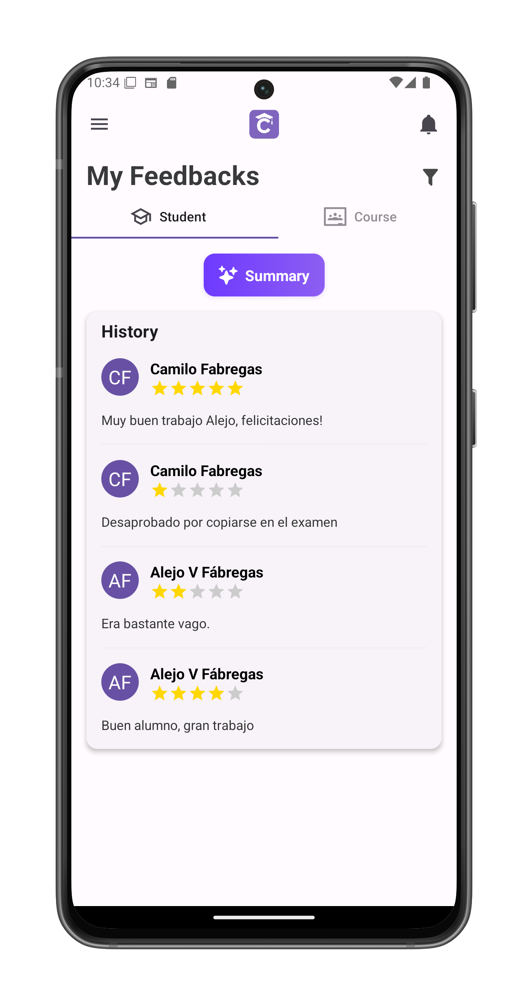
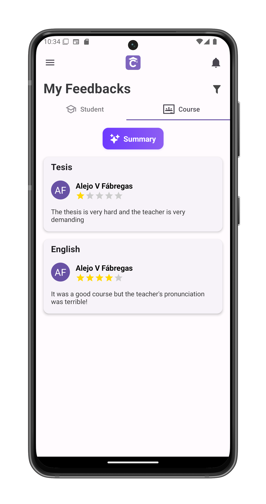
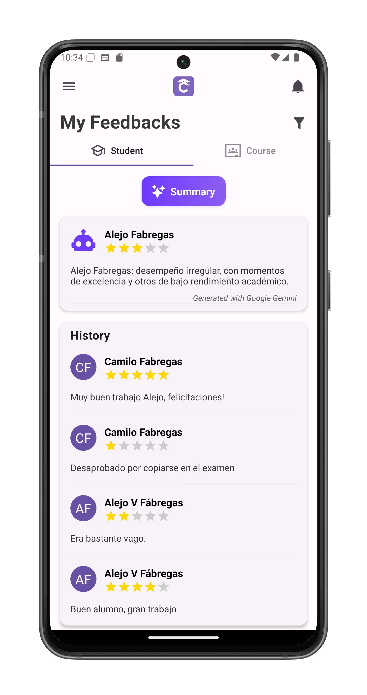
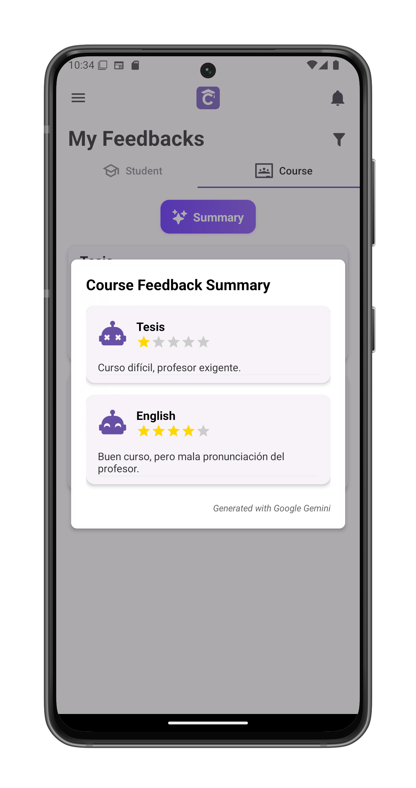

# View Your Feedbacks

Access all feedback you've received (as student) or collected (as teacher) in one centralized location.

## Accessing Feedback
1. Open the [navigation panel](/app-manual/app-navigation/drawer)
2. Tap **My Feedbacks**
3. System displays your feedback dashboard

## Feedback Tabs

### 1. Student Feedback (Learners)
- Shows evaluations from your teachers
- Organized (and sortable) by course
- Each entry displays:
  - Teacher's avatar/initials
  - Full name
  - Star rating (1-5)
  - Detailed comments
  

### 2. Course Feedback (Educators)
- Shows evaluations from students
- Grouped (and sortable) by course taught
- Each entry shows:
  - Student's avatar/initials and full name
  - Course name
  - Rating and comments

## AI-Powered Summaries
Tap **Summary** to generate:

### For Students:
- Unified evaluation of your performance
- Identifies consistent strengths/weaknesses
- Compares across courses
- 🤖 Robot avatar reacts to overall rating:

### For Teachers:
- Per-course sentiment analysis
- Common themes in student feedback
- Improvement suggestions
- 🤖 Robot avatar reacts to overall rating:

