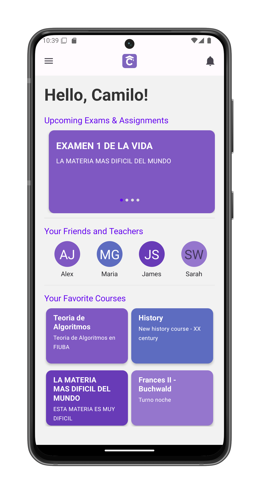

# Home Screen

The ClassConnect home screen provides quick access to your upcoming tasks and favorite courses.

## Screen Layout

### Top Banner
- **Navigation button**: Opens the [collapsible panel](drawer.md)
- **ClassConnect logo**: Centered in the banner
- **Notifications button**: Access your [notifications](notifications.md)

### Upcoming Exams & Assignments
- Displays swipeable cards of pending exams and assignments
- Sorted chronologically (nearest date first)
- Each card shows:
  - Course name
  - Exam/assignment title
  - Due date (for assignments) or exam date
- **Tap action**: Opens the corresponding course page

### Your Favorite Courses
- Shows courses you've marked as favorites
- Displayed in a grid (2 cards per row)
- **Tap action**: Opens the selected course

## Key Features

1. **Quick access** to time-sensitive academic tasks
2. **Visual organization** of important courses
3. **One-tap navigation** to key areas:
   - Course materials (via favorite courses)
   - App navigation (via panel button)
   - Notifications center

## Navigation Tips

- Swipe left/right to view all upcoming exams/assignments
- The home screen automatically updates when:
  - New assignments are posted
  - Exam dates change
  - You favorite/unfavorite courses
