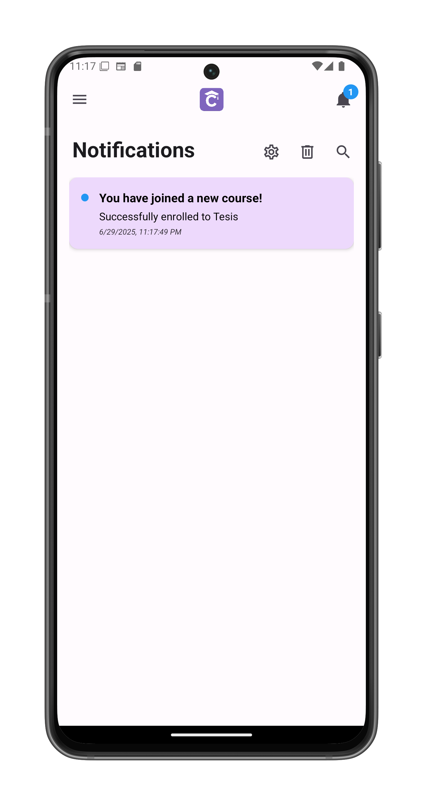
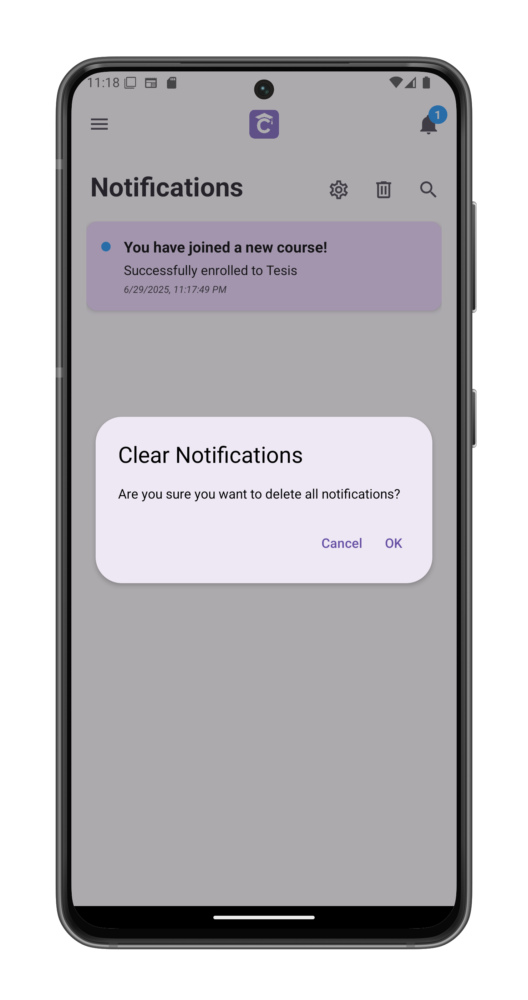
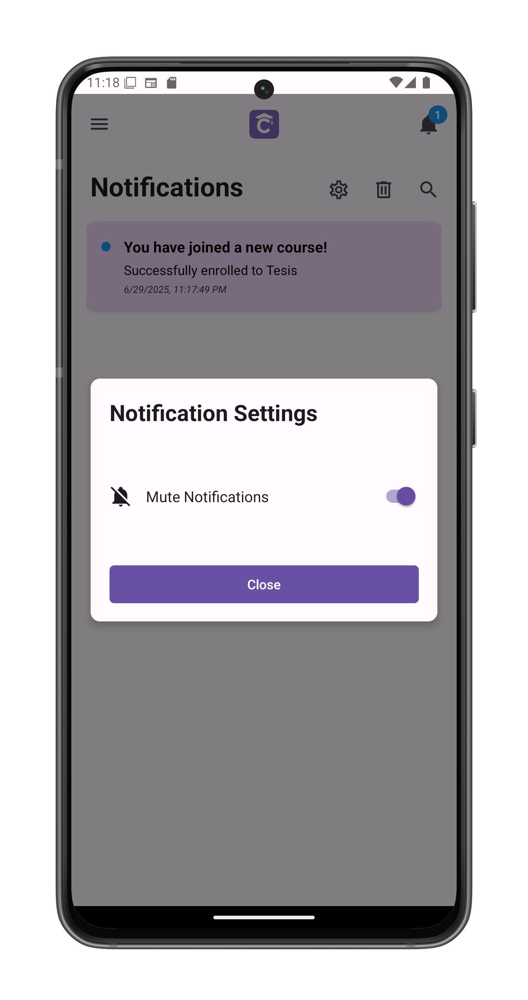

# Notifications Center

Access and manage your ClassConnect notifications by tapping the bell icon in the top-right banner. 
 If you have unread notifications, you will see a blue circle with the amount of new notifications.

## Notification Types

You'll receive notifications for:
- Course enrollments (new courses or when added as auxiliary teacher)
- Exam corrections and grades posted
- Feedback received from teachers
- Assignment deadlines approaching
- Important system announcements

## Interface Features

1. **Search Bar**
   - Filter notifications by typing keywords
   - Searches both title and content

2. **Clear All Notifications**
   - Tap the trashcan icon to initiate
   - Confirmation prompt appears:

3. **Mute Notifications**
   - Tap the switch icon to mute/unmute notifications

## Troubleshooting

If notifications aren't appearing:
1. Check your internet connection
2. Verify notification permissions are enabled
3. Ensure you haven't muted notifications
4. Restart the app if notifications seem delayed