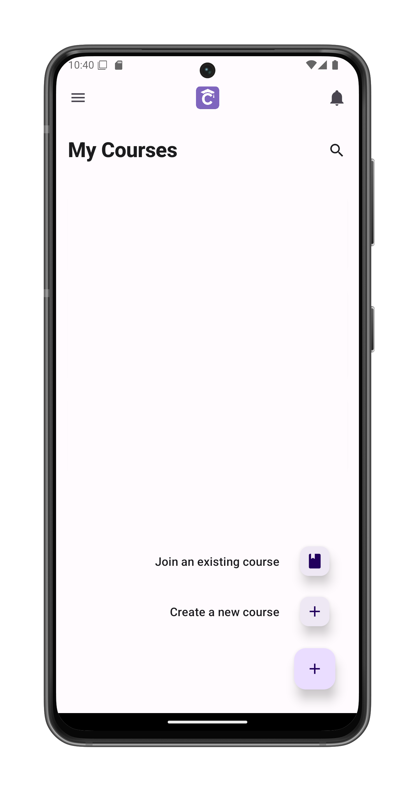

# My Courses

View and manage all courses you're enrolled in. From here you can join new courses or create your own.

## Course Cards

Each course displays as a card with:

1. **Course Name** (e.g., "Frances II - Buchwald")
2. **Description** (e.g., "Turno noche")
3. **Course Size** (e.g., "15 students")
4. **Role Badge** (right-aligned):
   - 🟢 Teacher (green)
   - 🔵 Assistant (blue)
   - 🟠 Student (orange)

## Navigation Options

### Join Existing Course
1. Tap the ⊕ button at bottom right
2. Select "Join existing course"
3. Opens the [course join screen](/app-manual/courses/course-join)

### Create New Course
1. Tap the ⊕ button at bottom right
2. Select "Create new course" 
3. Opens the [course creation screen](/app-manual/courses/course-create)

## Key Features

- **Pagination**: Navigate between pages of courses (bottom center)
- **Role Filtering**: Coming soon (will filter by Teacher/Student roles)
- **Quick Actions**: All major functions accessible from this screen

## Course Management Tips

- Tap any course card to [view details](/app-manual/courses/course-view)
- Long-press cards for additional options
- New courses appear instantly in your list