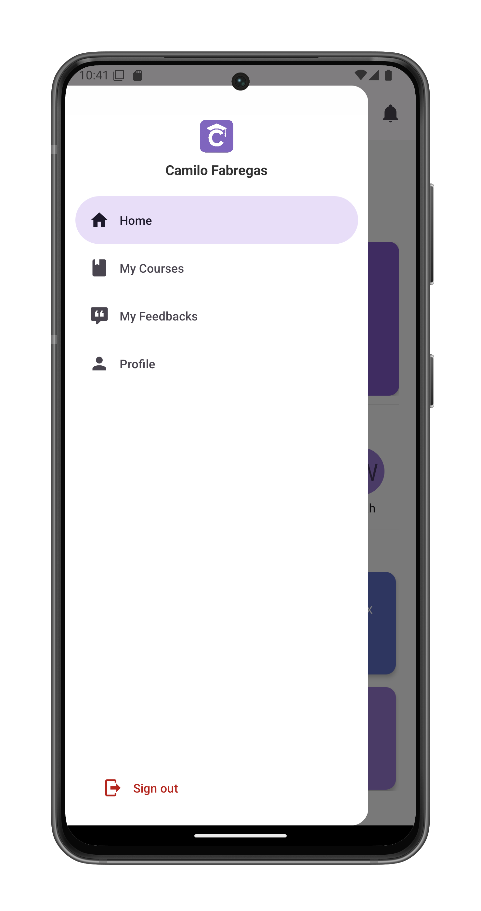

# Navigation Panel

The collapsible navigation panel provides quick access to key sections of ClassConnect.

## Accessing the Panel

1. Tap the navigation button in the top-left corner of any screen
2. The panel slides in from the left with a smooth animation
3. Tap anywhere outside the panel or swipe left to close it

## Panel Contents

### User Information
- Displays at the top of the panel:
  - ClassConnect logo
  - Your full name (e.g., "Camilo Fabregas")

### Navigation Options

1. **Home**
   - Returns you to the [home screen](home.md)
   - Closes the panel automatically

2. **My Courses**
   - Opens your [courses overview](courses.md)
   - View all courses you're enrolled in
   - Join or create new courses

3. **My Feedbacks**
   - Access your [feedback dashboard](feedbacks.md)
   - View feedback from teachers (students)
   - Review feedback given to students (teachers)

4. **Profile**
   - Navigates to your [profile page](profile.md)
   - View and edit your account information
   - Access account management options

### Session Control
- **Sign Out** button at the bottom:
  - Logs you out of ClassConnect
  - Returns you to the start screen

## Usage Tips

- The panel remembers your last visited section
- Works consistently across all app screens
- Automatically updates with profile name changes