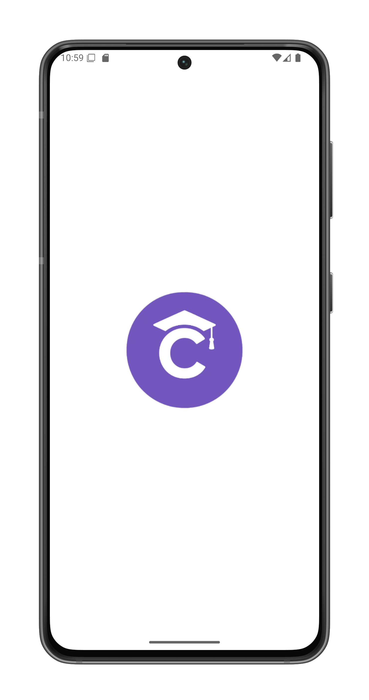
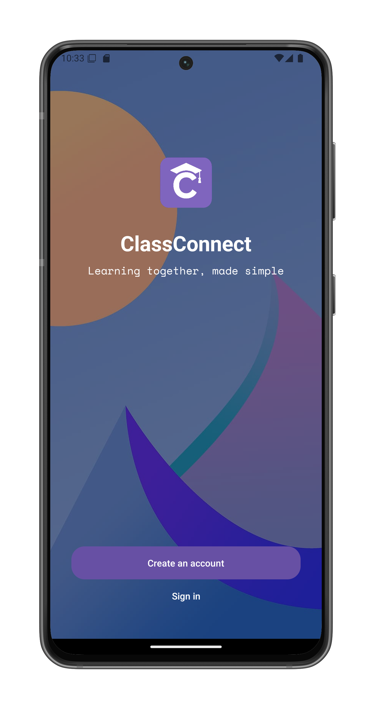

# System Requirements

To use ClassConnect, you only need:

1. An Android phone capable of installing `.apk` files (Android 8.0 or newer recommended)

## Installation Instructions

### Downloading the APK

You can obtain the ClassConnect application in one of two ways:

1. **Direct download on your Android phone**:
   - Open your mobile browser and navigate to our GitHub releases page
   - Download the latest `.apk` file
   - Open the downloaded file to begin installation

2. **Transfer from PC**:
   - Download the `.apk` file on your computer
   - Connect your phone via USB cable
   - Transfer the file to your phone's storage
   - Locate and open the file on your phone to begin installation

### Installation Process

When installing the APK:
1. You may need to enable "Install unknown apps" permission for your browser or file manager
2. Follow the on-screen prompts to complete installation
3. The app will appear in your app drawer once installed

## First Launch

After installation:
1. Open ClassConnect from your app drawer
2. You will see the splash screen displaying the ClassConnect logo (see below)

3. The app will then show the start screen where you can:
   - Create a new account
   - Sign in if you already have an account

