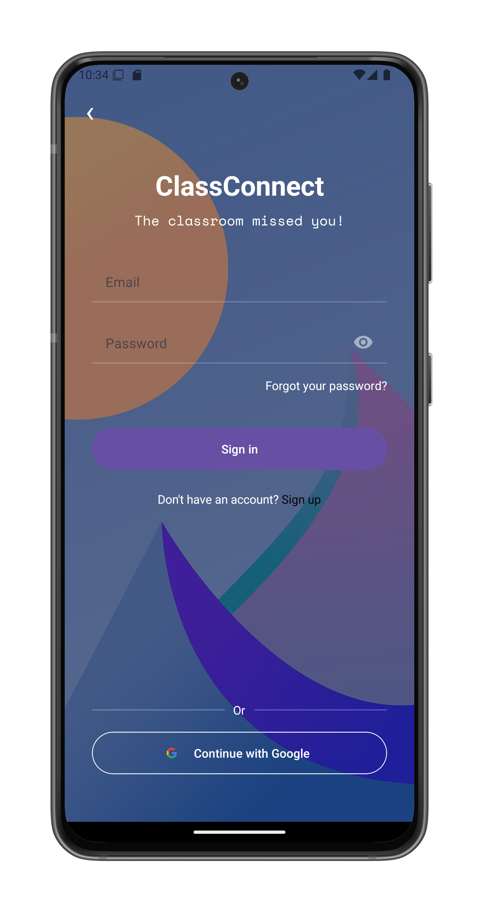
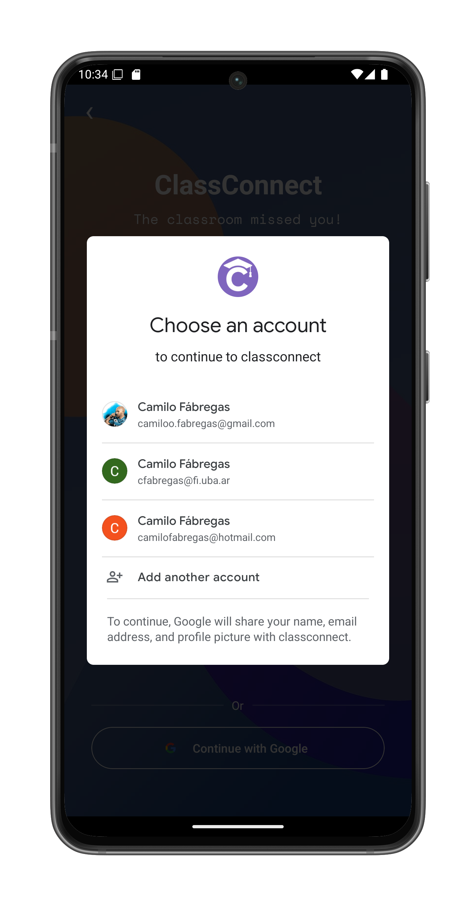
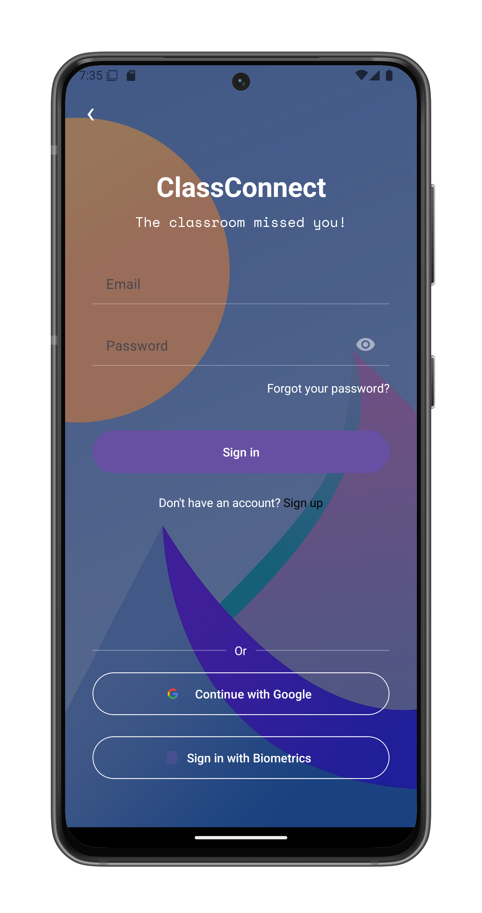
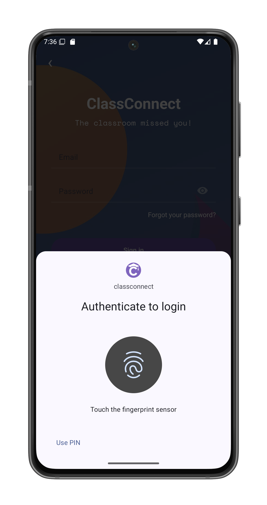

# Sign In to ClassConnect

You can access your ClassConnect account using email/password, Google sign-in, or biometric authentication.

## Email Password Login

1. Open the ClassConnect app
2. On the start screen, select "Sign in"

3. Enter your registered email address
4. Enter your password
5. Tap "Sign in"

## Google Sign-In

1. From the sign-in screen, tap "Continue with Google"
2. Select your Google account:

3. Grant permission when prompted

## Biometric Authentication

After your first successful email/password login, you'll see the biometric option on future sign-ins:

1. Tap "Sign in with Biometrics"
2. Verify your identity using fingerprint:

## After Successful Login

You will be automatically redirected to:
- The ClassConnect home screen
- Your last active session will be restored

## Notes

- Biometric login only appears after initial email/password authentication
- Google-authenticated sessions cannot use biometric login
- You must have fingerprint/FaceID configured on your device
- The app remembers your login method preference

## Troubleshooting

If you can't sign in:
- Check your internet connection
- Verify your email/password is correct
- Ensure Google Play Services is updated (for Google sign-in)
- Confirm your device supports biometric authentication if the option is missing
- Try restarting the app if biometric prompts don't appear