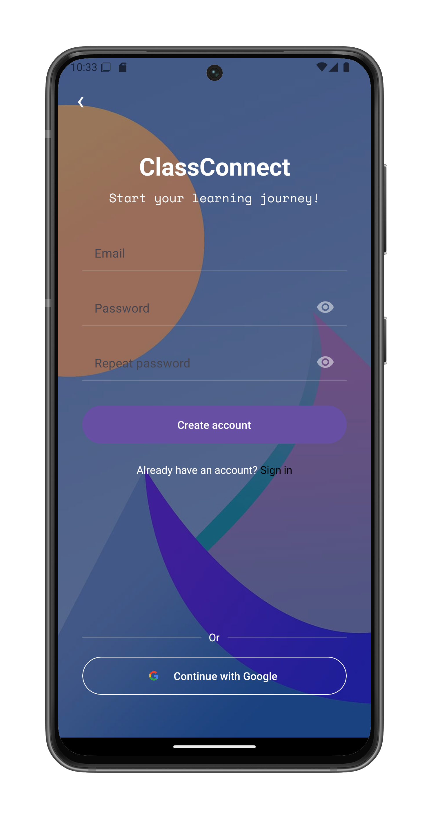
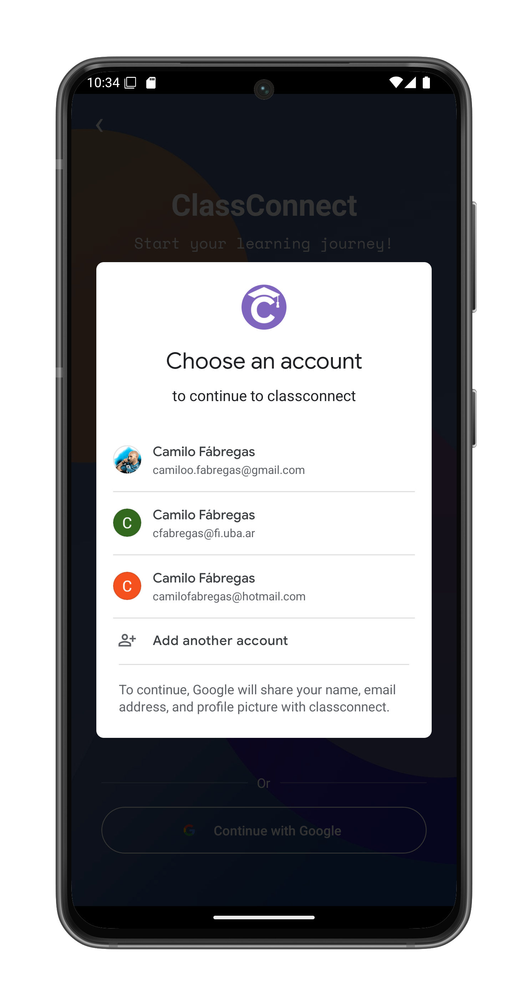
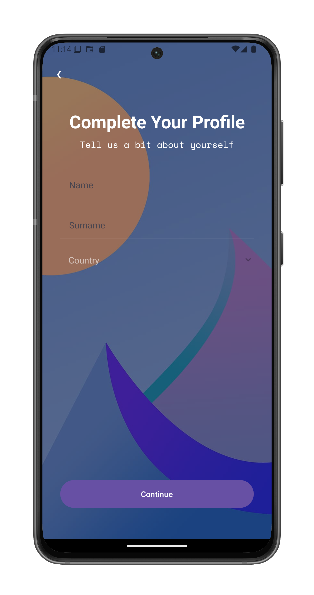

# Create an Account

You can create a ClassConnect account using either email registration or your Google account.

## Email Registration

1. Open the ClassConnect app
2. On the start screen, select "Create account"
3. Fill in the required information:

- Email address
- Password (enter twice for verification)
- Tap "Create account" when done

## Google Sign-In

Alternatively, you can sign up using your Google account:

1. Tap "Continue with Google"
2. Select your preferred Google account from the list:

3. Grant permission for ClassConnect to access your basic profile information

## Complete Your Profile

After initial registration (via email or Google), you'll need to:

1. Provide additional information:
- First name
- Last name
- Country
2. Tap "Continue"

## Next Steps

After successful registration:
- You'll be automatically logged in
- The app will redirect you to the ClassConnect home screen
- You can now explore courses or update your profile

## Troubleshooting

If you encounter issues:
- Ensure you have internet connection
- Verify your email address is valid
- Make sure passwords match when using email registration
- Check that you have Google Play Services installed when using Google sign-in