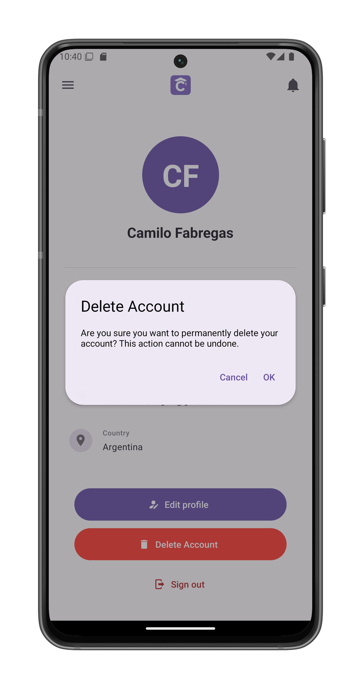

# Delete Your Account

Permanently remove your ClassConnect account and all associated data. Accessed via the [Delete Account] button on your [profile page](/app-manual/profile/profile).

## Account Deletion Process

1. **Confirmation Screen** appears when selecting "Delete Account"
   - Clearly states the action cannot be undone
   - Displays your account name for verification

2. **Options**:
   - **Cancel**: Returns to your profile without changes
   - **OK**: Permanently deletes your account

## Consequences of Deletion

- All account data will be permanently erased:
  - Profile information
  - Course enrollments
  - Submitted assignments
  - Feedback records
- This action is irreversible
- You will need to create a new account to use ClassConnect again

## After Deletion

- You will be automatically signed out
- The app will return to the start screen

## Security Notes

- Requires active authentication session
- Cannot be performed while offline
- No recovery period - deletion is immediate