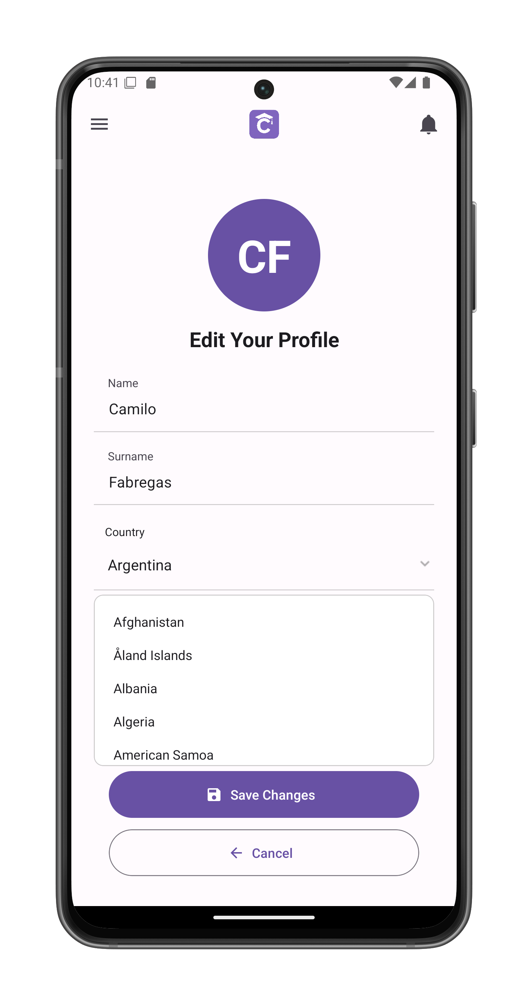

# Edit Your Profile

Modify your personal information in ClassConnect. Accessed via the [Edit profile] button on your [profile page](/app-manual/profile/profile).

## Editable Fields

1. **Name** (First name)

2. **Surname** (Last name)

3. **Country**
   - Tap to open country selection list
   - Searchable dropdown with all countries
   - Preselects your current country

## Actions

### Save Changes
- Applies all modifications
- Returns to profile view
- Shows confirmation message

### Cancel
- Discards any unsaved changes
- Returns to profile view
- No modifications are saved

## Country Selection
- Full list of available countries
- Scrollable interface
- Current selection highlighted

## Validation Rules
- Both name fields are required
- Special characters limited to hyphens and apostrophes
- Country must be selected from provided list
- Changes won't save if validation fails

## Notes
- Email address cannot be changed here