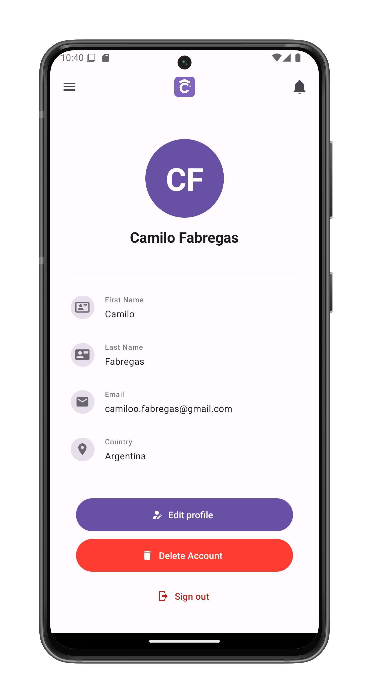

# Your Profile

Access your personal information and account management options. This screen can be accessed from the [Navigation Panel](drawer.md).

## Profile Information

Displays your current account details:

1. **Avatar**
2. **Full Name**
3. **Personal Details**:
   - First Name
   - Last Name
   - Email Address
   - Country

## Account Actions

### Edit Profile
- Tap "Edit profile" to modify your information
- Opens the [profile editing screen](profile-edit.md)

### Delete Account
- Permanently remove your ClassConnect account
- Opens the [account deletion screen](profile-delete.md)
- Requires confirmation

### Sign Out
- Log out of your current session
- Returns you to the start screen

## Important Notes

- Profile changes sync across all devices
- Email address cannot be changed (contact support if needed)

## Security

- Always sign out when using shared devices
- Sensitive actions (deletion) require additional confirmation