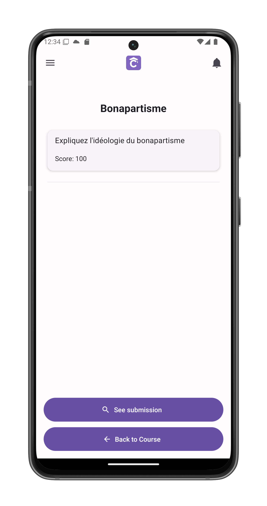

# Answer an Activity or Exam

Complete and submit your work for course assessments.

## Accessing Activities
1. Navigate to the [course view](/app-manual/students/course-view)
2. Select the **Activities** or **Exams** tab
3. Tap any pending activity

## Activity Overview Screen
Displays:
- Activity title (e.g., "Bonapartisme")
- Total possible score
- Completion status
- **Complete activity** button

## Answering Questions

1. View each question with:
   - Point value
   - Answer field (type directly or upload)
2. For writing questions:
   - Full rich text editor
   - Word count visible
3. Tap **Submit Answer** when complete

## Post-Submission

- "See submission" option appears
- View your submitted answers
- Go back to the course

## Graded Results
When evaluated by teacher:

1. Final score displayed
2. Teacher feedback visible
3. Breakdown by question
4. Option to:
   - Review corrections
   - Request clarification
   - View model answers (if enabled)

## Best Practices
- Draft longer answers externally
- Review rubric before submitting
- Check feedback for improvements
- Keep submission receipts