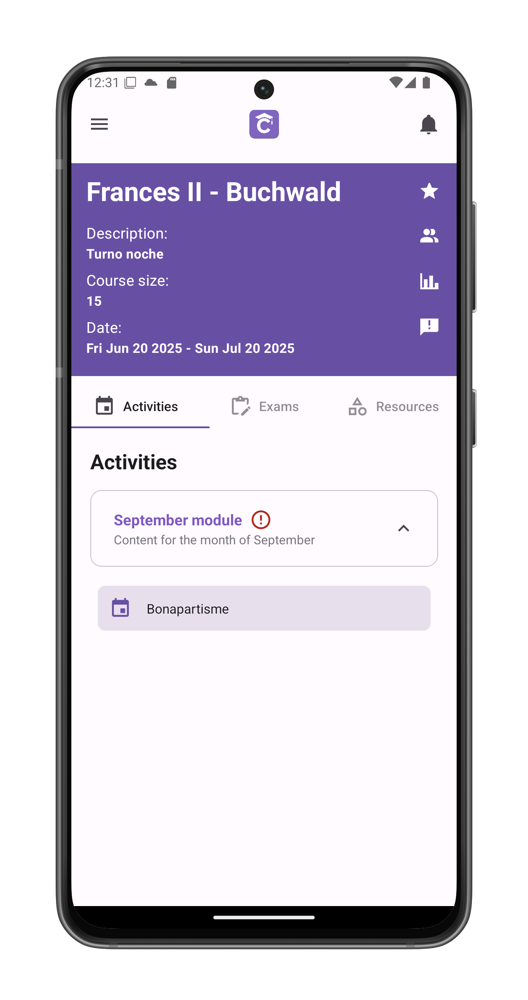
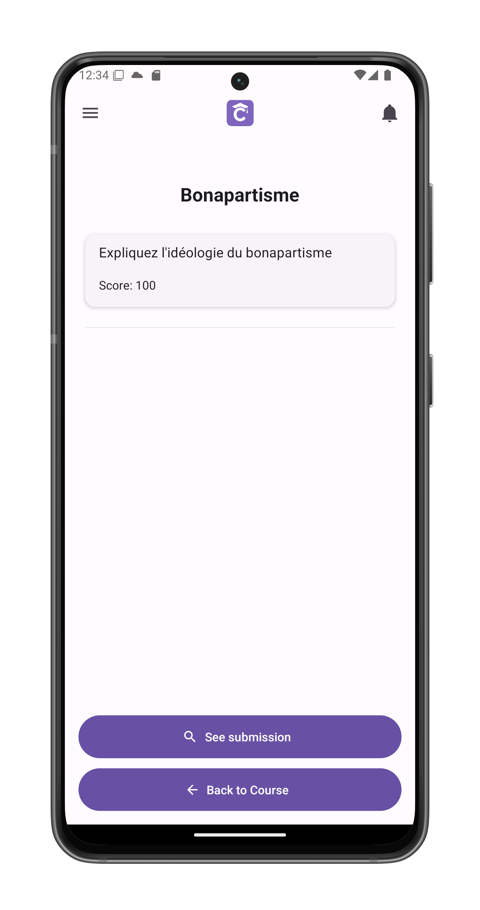
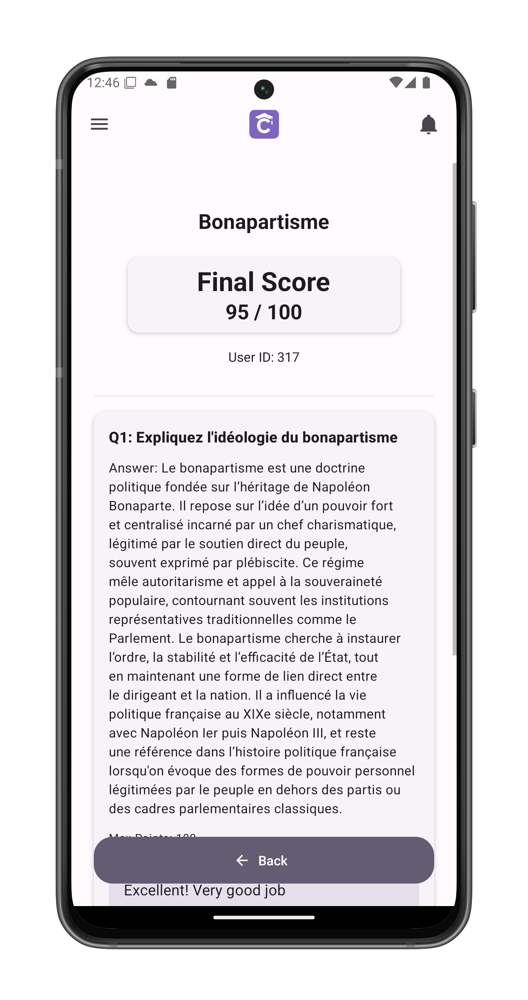
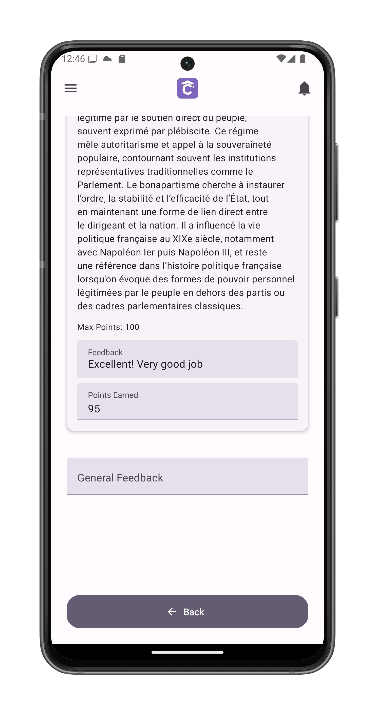

# View Activity/Exam Corrections

Review your graded submissions and instructor feedback.

## Accessing Feedback
1. Navigate to the activity in [course view](/app-manual/students/course-view)
2. Locate your submitted activity
3. Tap **See submission**

## Correction Overview
Displays:
- Final score (e.g., 95/100)
- Original submission by the student

## Detailed Feedback
Scroll down to view:

### 1. Question-Specific Evaluation
- Your original answer
- Points earned per question
- Targeted feedback on responses

### 2. General Assessment
- Overall performance notes
- Improvement suggestions
- Positive reinforcement

## Learning Tips
1. Review all comments carefully
2. Compare with rubric criteria
3. Note recurring improvement areas
4. Save exemplary feedback as examples