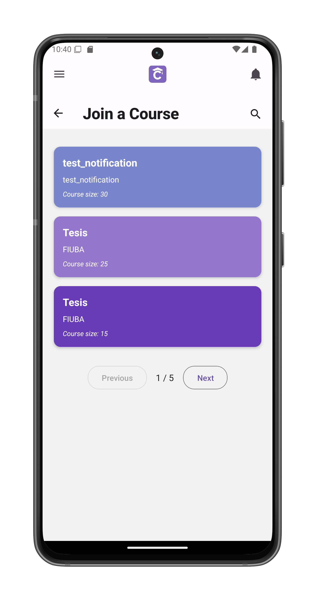
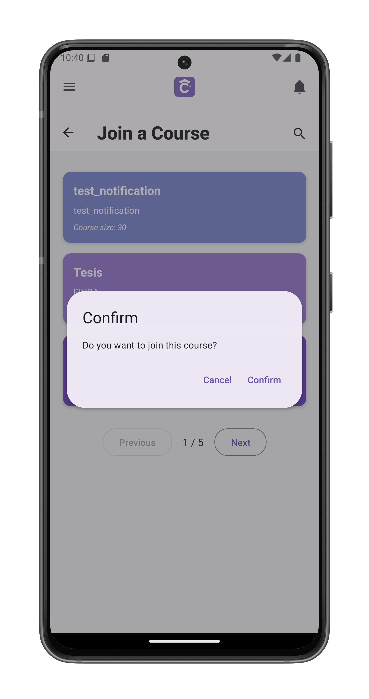

# Join A Course

Browse and join available courses. Accessed from [My Courses](/app-manual/app-navigation/courses) by tapping "Join an existing course".

## Course Selection

Displays available courses as cards:

1. **Course Name**
2. **Description**
3. **Course Size**

## Joining Process

1. Tap any course card to select
2. Confirmation screen appears with actions:
   - **[Cancel]**: Returns to course list
   - **[Confirm]**: Joins the course

## Navigation

- **Pagination**: Browse pages (bottom center)
- **Back**: Returns to [My Courses](/app-manual/app-navigation/courses)
- **Cancel**: Available during confirmation

## Important Notes

- You may not be able to join a course if it's full
- Course appears immediately in [your list](/app-manual/app-navigation/courses) after joining