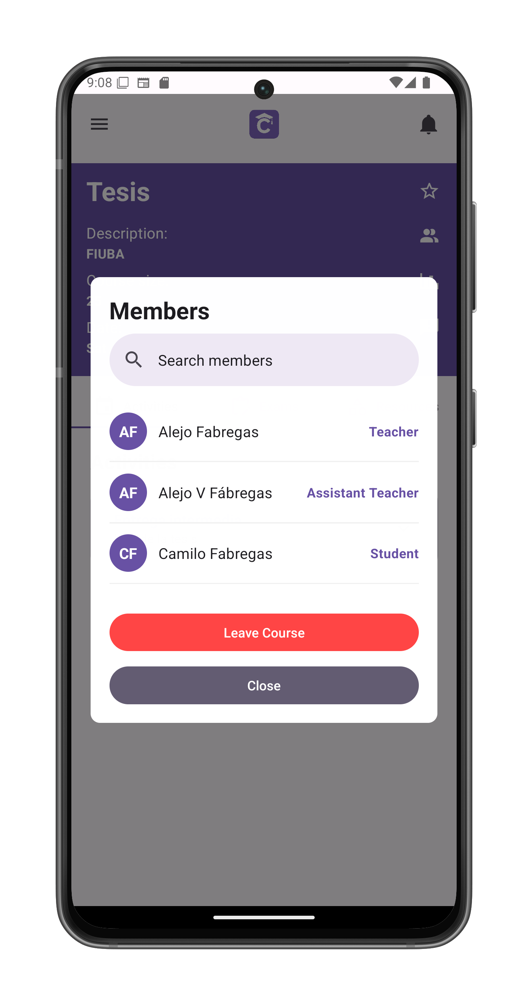
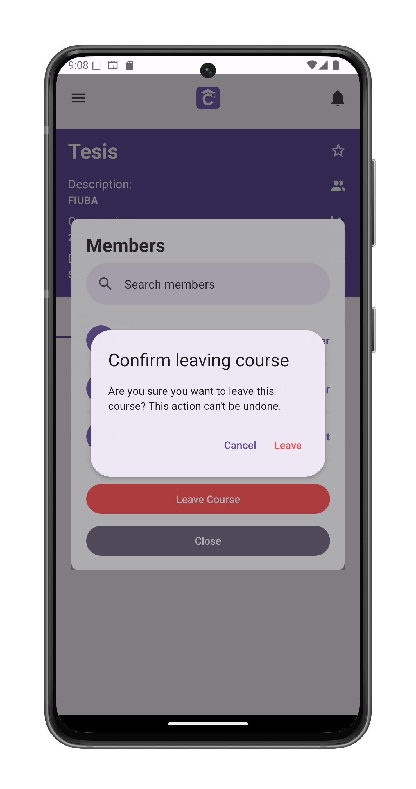

# Leave A Course

Permanently remove yourself from a course. This action cannot be undone.

## Initiate Course Leave
1. Tap the **members icon** in [course view](/app-manual/students/course-view)
2. Locate the **Leave Course** button at bottom
3. System displays confirmation dialog

## Confirmation Process
The system will:
1. Display warning message:
   - "You will lose access to all course materials"
   - "This action is permanent"
   
2. Require explicit confirmation:
   - **[Cancel]**: Returns to course
   - **[Confirm]**: Processes withdrawal

## Post-Leave Process
After confirmation:
- Immediate removal from course roster
- Redirect to [My Courses](/app-manual/app-navigation/courses)
- Course disappears from your dashboard
- Content access revoked immediately

## Data Retention
- Your submissions remain visible to instructors
- Grades preserved in academic records
- No automatic content deletion