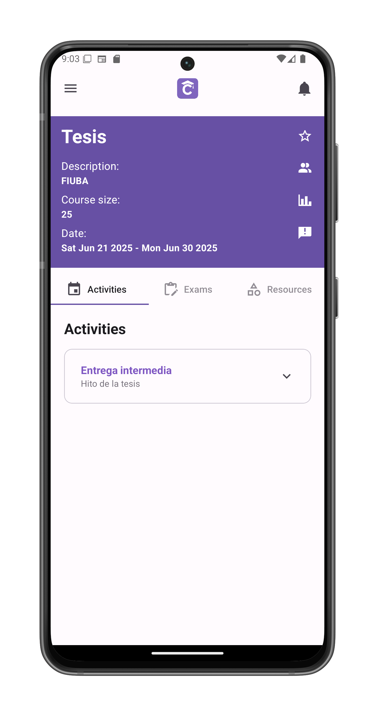
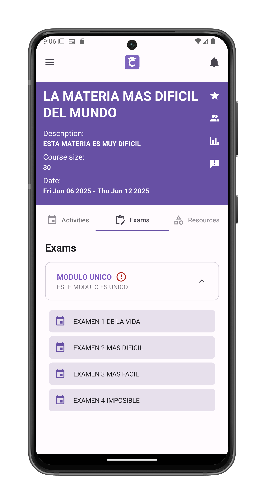

# Explore A Course (Student)

The central hub for all course activities, exams, and resources.

## Course Header
Purple information card displays:
- **Course Title**
- **Description**
- **Class Size** (e.g., "25 students")
- **Dates** (Start/End)

## Action Buttons (Right Side)
1. **Star Icon** ★  
   - Toggle favorite status
   - Favorite courses appear on [home screen](/app-manual/app-navigation/home)

2. **Members Icon** 👥  
   - View all participants

3. **Metrics Icon** 📊  
   - View performance analytics
   - Compare with other courses

4. **Feedback Icon** 📋 (Students only)  
   - [Send feedback to the course](/app-manual/students/feedback-course)

## Content Tabs
1. **Activities**  
   - Are not graded and have a due date
   - Grouped by [modules](/app-manual/teachers/module-create)

2. **Exams**  
   - Scheduled tests and quizzes
   - Grouped by [modules](/app-manual/teachers/module-create)

3. **Resources**  
   - Study materials (documents, videos, links)
   - Grouped by [modules](/app-manual/teachers/module-create)

## Student Actions

Tap an activity (exam or assignment) in one of the tabs to:
- [Answer an activity or exam](/app-manual/students/activity-answer)

## Module Navigation
- Tap any module box to view its contents
- Contents adapt to current tab:
  - **Activities tab**: Shows module's assignments
  - **Exams tab**: Displays module's tests
  - **Resources tab**: Lists module's materials