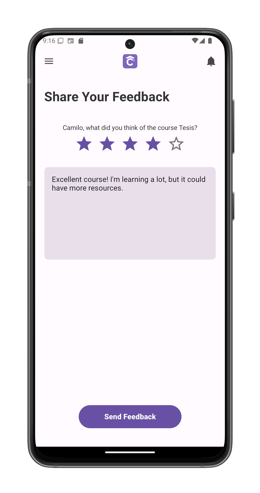

# Submit Feedback to a Course

Share your experience and suggestions to help improve the course.

## Accessing Course Feedback
1. Tap the **feedback icon** in [course view](/app-manual/students/course-view)
2. System opens the feedback composition screen

## Feedback Interface
The form includes:

1. **Course Information**  
   - Course name (pre-filled)
   - Instructor name
   - Current term

2. **Rating System**  
   - 5-star scale (tap to select)
   - Rating descriptors:
     - ★☆☆☆☆ - Poor
     - ★★☆☆☆ - Fair  
     - ★★★☆☆ - Average
     - ★★★★☆ - Good
     - ★★★★★ - Excellent

3. **Written Feedback**  
   - Free-form comment field
   - Prompt: "What did you think of this course?"
   - Suggestions for improvement encouraged

## Submission Process
1. Provide star rating (required)
2. Enter comments (optional but recommended)
3. Tap **Send Feedback** to:
   - Submit anonymously to instructors
   - Return to [course view](/app-manual/students/course-view)

## Best Practices
- Focus on specific aspects:
  - Course materials
  - Teaching methods
  - Assignment quality
- Provide constructive suggestions
- Mention what worked well