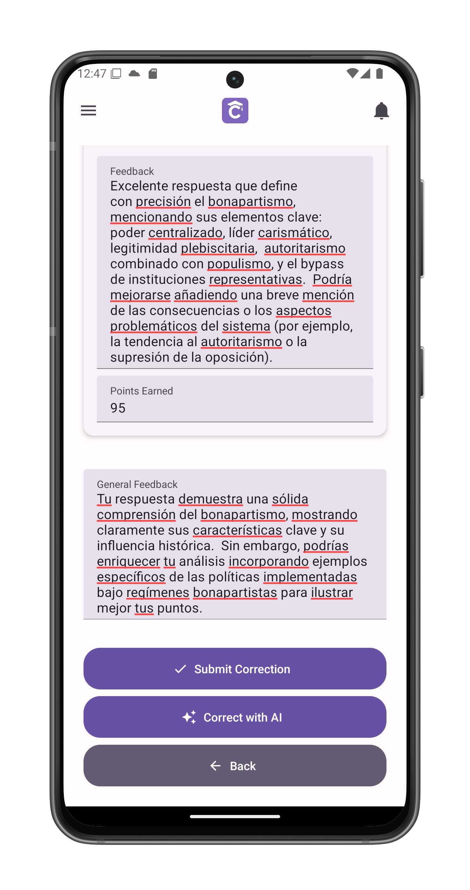

# Correct a Test or Assignment

Evaluate and provide feedback on student submissions.

## Accessing Submissions
1. Navigate to the activity in [course view](/app-manual/teachers/course-view)

2. Tap **See submissions** below the activity title

## Student List
Displays all submissions by student name.
Select a student to view their work:

### Manual Correction
1. **Per-Question Feedback**:
   - Enter points earned (0-100)
   - Add specific comments

2. **General Feedback**:
   - Overall assessment
   - Improvement suggestions
   - Positive reinforcement

### AI-Assisted Correction
1. Tap **Correct with AI** to:
   - Automatically score responses
   - Generate detailed feedback
   - Identify key concepts

2. Review and edit AI suggestions:

## Finalizing Grades
1. **Submit Correction** to:
   - Record the evaluation
   - Notify the student
   - Lock the submission

## Important Notes
- Grades sync to student profiles
- Feedback appears in [student view](/app-manual/students/activity-correction)

## Best Practices
- Use rubrics for consistency
- Balance praise with constructive feedback
- Flag exceptional work
- Note patterns across submissions