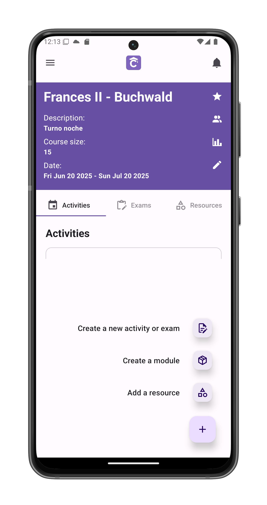
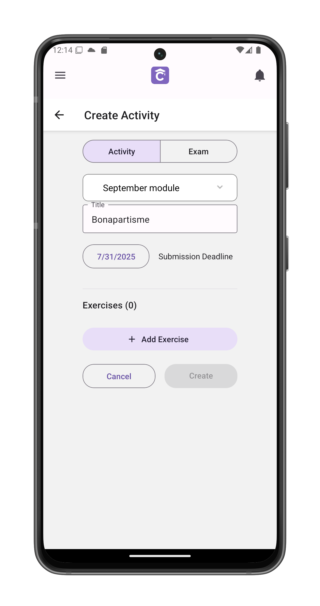
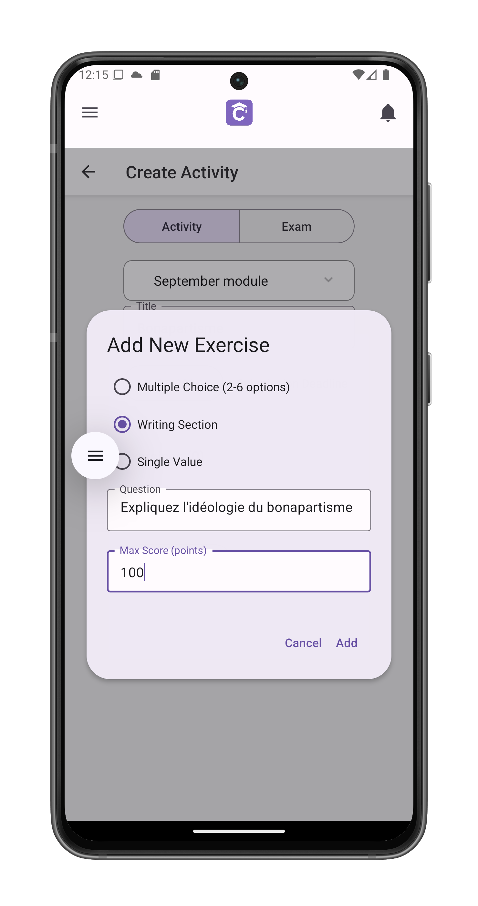
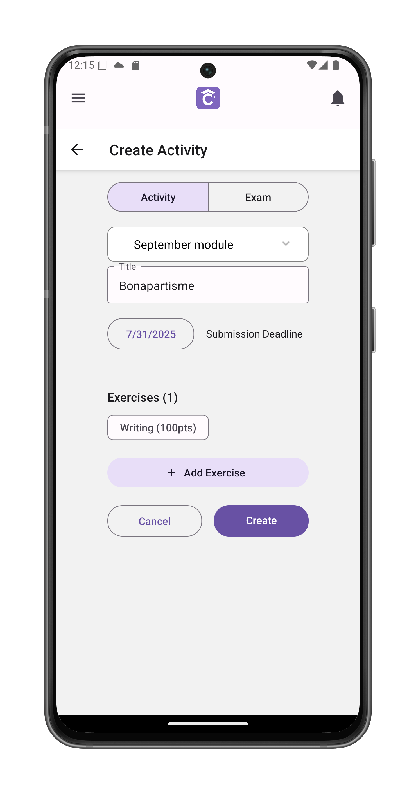
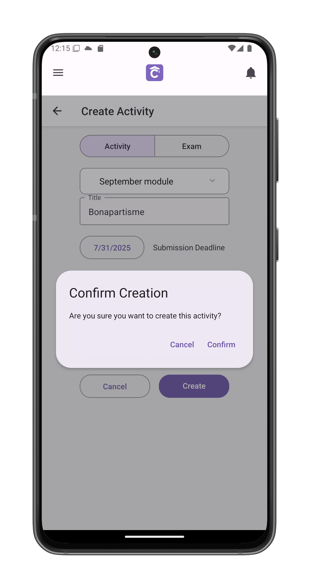

# Create a Test or Assignment

Design assessments and learning activities for your students. Activities can include exams, homework assignments, or practice exercises.

## Initiate Creation
1. Tap the + button in [course view](/app-manual/teachers/course-view)
2. Select "Create new activity or exam"
3. Choose between:
   - **Activity**: Homework/practice
   - **Exam**: Graded assessment

## Basic Configuration
1. **Select Module**  
   Choose existing module (e.g., "September module")

2. **Title**  
   Descriptive name (e.g., "Bonapartisme")

3. **Deadline**  
   Submission due date (e.g., "7/31/2025")

## Exercise Creation
Tap **+ Add Exercise** to:

### Exercise Types
1. **Multiple Choice**  
   - 2-6 answer options
   - Single correct answer

2. **Writing Section**  
   - Open-ended response
   - Set maximum score (e.g., 100pts)

3. **Single Value**  
   - Numerical/one-word answers
   - Exact match grading

## Finalization
1. Review configured exercises
2. Tap **Create** to:
   - Display confirmation dialog
   - Verify activity details

## Post-Creation
- Activity appears in selected module
- Immediately visible to students

## Important Notes
- Minimum 1 exercise required
- Deadlines can be extended later

## Best Practices
- Mix question types for better assessment
- Set clear grading criteria
- Use modules for organization