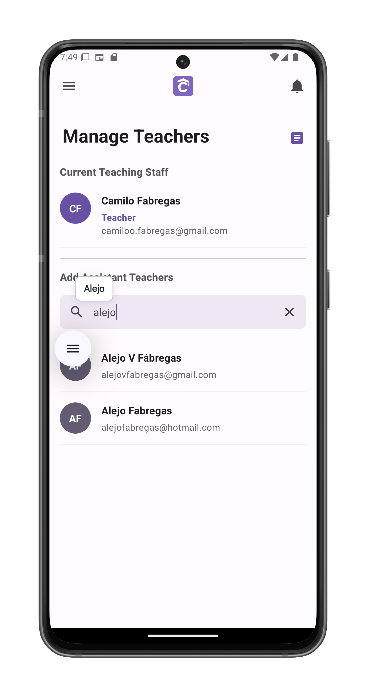

# Manage Auxiliary Teachers

Assign or remove teaching assistants who can help with grading and student feedback. Accessed via the members icon in [course view](/app-manual/teachers/course-view).

## Accessing Teacher Management
1. Navigate to course members
2. Tap **Manage Teachers** button (visible only to main teachers)
3. Opens the auxiliary teachers management interface

## Interface Features

### Current Teaching Staff
Displays all users with teaching privileges:
- **Main Teachers** (cannot be removed)
- **Auxiliary Teachers** (tap trash icon to remove)

### Add New Auxiliaries
1. **Search** by:
   - Name
   - Surname
   - Email address
2. **Results** show:
   - Profile picture/initials
   - Full name
   - Email address
3. **Tap any user** to:
   - Grant auxiliary status
   - Shows confirmation screen
   - Add to current staff list

### Activity Log
- **Purple page icon** (top-right) shows:
  - All auxiliary teacher actions
  - Timestamped changes
  - Student interactions

## Privileges Granted
Auxiliary teachers can:
- Grade assignments and exams
- Provide student feedback
- Access course materials

## Restrictions
Cannot:
- Edit the course
- Delete the course
- Remove main teachers

## Important Notes
- Changes take effect immediately
- Removed auxiliaries lose access instantly
- Activity log cannot be modified