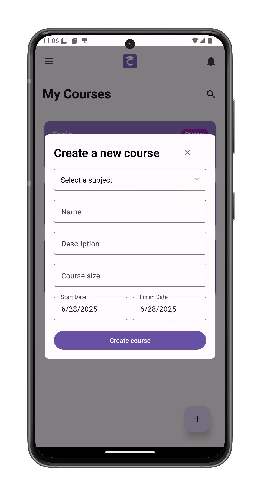
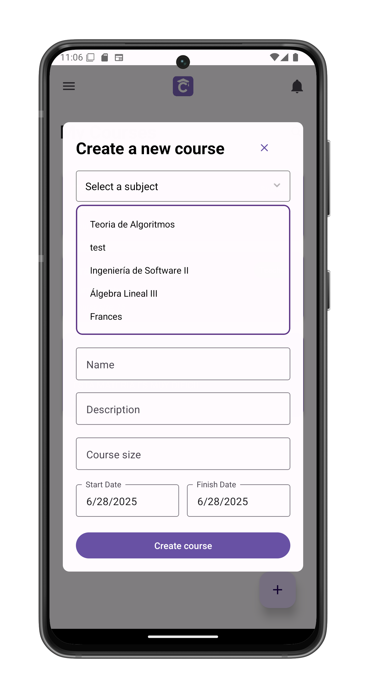

# Create a New Course

Establish a new course and become its teacher. Accessed from [My Courses](/app-manual/app-navigation/courses) by tapping "Create new course".

## Step 1: Select Subject
Choose from available subjects:
- Teoría de Algoritmos
- Ingeniería de Software II
- Álgebra Lineal III
- Frances
- (Among others)

## Step 2: Course Details
Complete all required fields:

1. **Course Name**  
   (e.g., "Frances II - Buchwald")

2. **Description**  
   (e.g., "Turno noche - Nivel avanzado")

3. **Course Size**  
   Maximum students allowed (e.g., 30)

4. **Dates**  
   - Start Date: ______ (Default: current date)  
   - Finish Date: ______  

## Final Step
Tap **Create Course** to:
- Establish the new course
- Automatically become its Teacher
- Redirect to the [course page](/app-manual/teachers/course-view)

## Troubleshooting
If creation fails:
1. Verify all required fields
2. Check date validity (end > start)
3. Ensure subject is selected