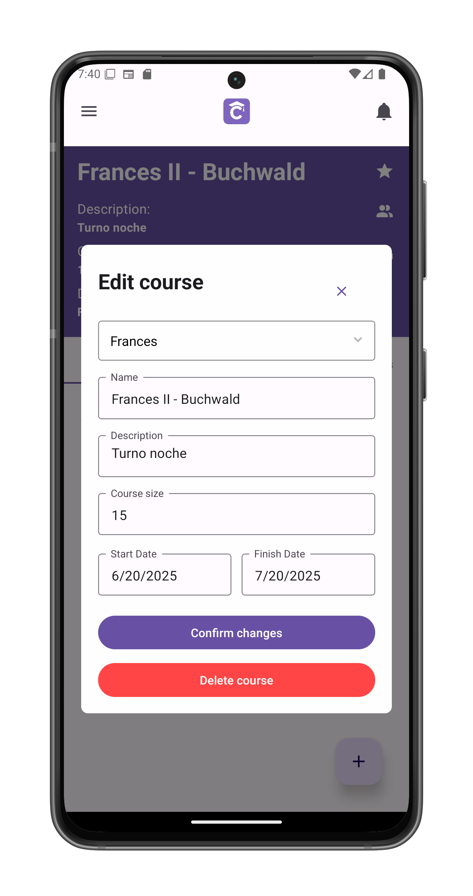

# Edit/Delete A Course

Modify course details or delete the course entirely. Accessed via the pencil icon in [course view](/app-manual/teachers/course-view).

## Editable Fields

1. **Subject**  
   (Dropdown with all available subjects)

2. **Course Name**  

3. **Description**  

4. **Course Size**   
   (Maximum capacity)

5. **Dates**  
   - Start Date
   - Finish Date

## Actions

### Save Changes
Tap **Confirm changes** to:
- Update all modified fields
- Apply changes immediately
- Return to [course view](/app-manual/teachers/course-view)

### Delete Course
Tap **Delete course** to:
- Initiate deletion process
- Requires final confirmation
- Redirect to [My Courses](/app-manual/app-navigation/courses)