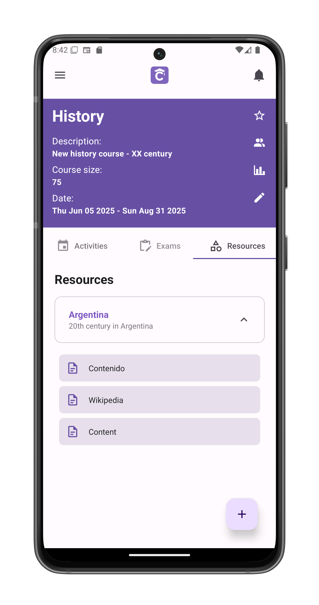

# Explore A Course (Teachers)

The central hub for all course activities, exams, and resources.

## Course Header
Purple information card displays:
- **Course Title** (e.g., "Frances II - Buchwald")
- **Description** (e.g., "Turno noche")
- **Class Size** (e.g., "15 students")
- **Dates** (Start/End)

## Action Buttons (Right Side)
1. **Star Icon** ★  
   - Toggle favorite status
   - Favorite courses appear on [home screen](/app-manual/app-navigation/home)

2. **Members Icon** 👥  
   - View all participants
   - [Manage auxiliary teachers](/app-manual/teachers/auxiliary)
   - [Send student feedback](/app-manual/teachers/feedback-student)

3. **Metrics Icon** 📊  
   - View performance analytics
   - Compare with other courses

4. **Pencil Icon** ✏️ (Teachers only)  
   - [Edit course details](/app-manual/teachers/course-edit)
   - [Delete the course](/app-manual/teachers/course-edit)

## Content Tabs
1. **Activities**  
   - Are not graded and have a due date
   - Grouped by [modules](/app-manual/teachers/module-create)

2. **Exams**  
   - Scheduled tests and quizzes
   - Grouped by [modules](/app-manual/teachers/module-create)

3. **Resources**  
   - Study materials (documents, videos, links)
   - Grouped by [modules](/app-manual/teachers/module-create)

## Teacher Actions

Tap the ⊕ button to:
- [Create new module](/app-manual/teachers/module-create)
- Add [new activity](/app-manual/teachers/activity-create)
- Schedule [new exam](/app-manual/teachers/exam-create)
- Upload [new resources](/app-manual/teachers/resource-create)

## Module Navigation
- Tap any module box to view its contents
- Contents adapt to current tab:
  - **Activities tab**: Shows module's assignments
  - **Exams tab**: Displays module's tests
  - **Resources tab**: Lists module's materials