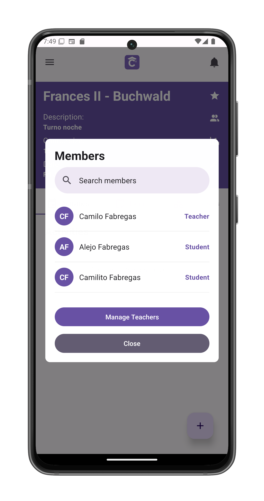
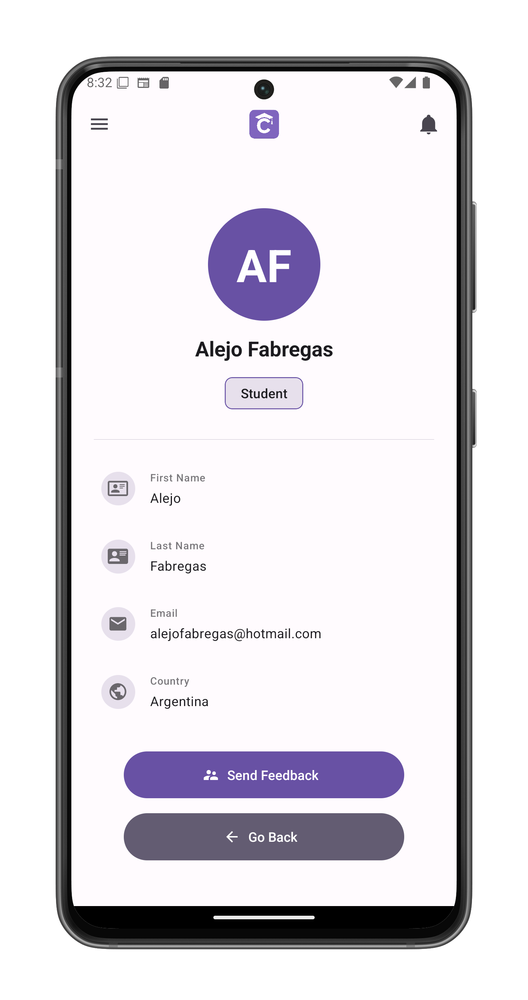
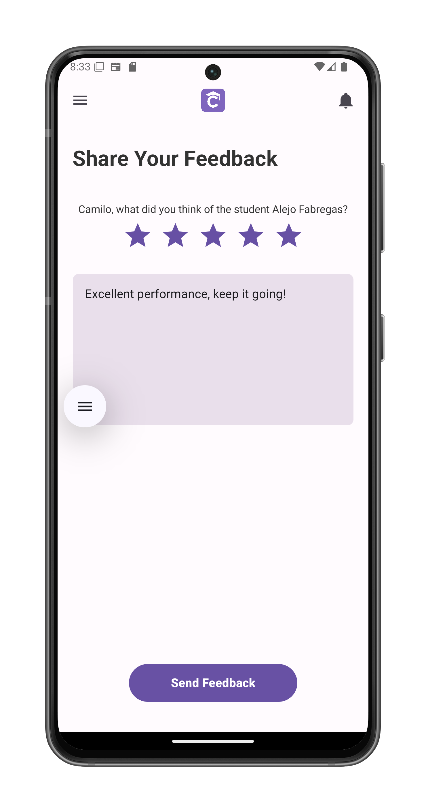

# Submit Feedback to a Student

Provide personalized feedback to students about their performance and progress.

## Accessing Student Feedback
1. Tap the **members icon** in [course view](/app-manual/teachers/course-view)
2. Select a student from the list
3. Tap **Send Feedback** on their profile

## Feedback Interface
The feedback form includes:

1. **Student Information**  
   - Name
   - Email  
   - Country
   - Current grade (if available)

2. **Rating System**  
   - 5-star scale (tap to select)
   - Hover descriptions:
     - ★☆☆☆☆ - Needs improvement
     - ★★☆☆☆ - Satisfactory  
     - ★★★☆☆ - Good
     - ★★★★☆ - Very good
     - ★★★★★ - Excellent

3. **Written Feedback**  
   - Free-form comment field

## Submission Process
1. Complete all required fields
2. Tap **Send Feedback** to:
   - Deliver immediately to student
   - Return to [student profile](#)

## Important Notes
- Feedback is:
  - Visible to the student immediately
  - Recorded permanently

## Best Practices
- Be specific about strengths/areas to improve
- Reference particular assignments
- Balance constructive criticism with encouragement