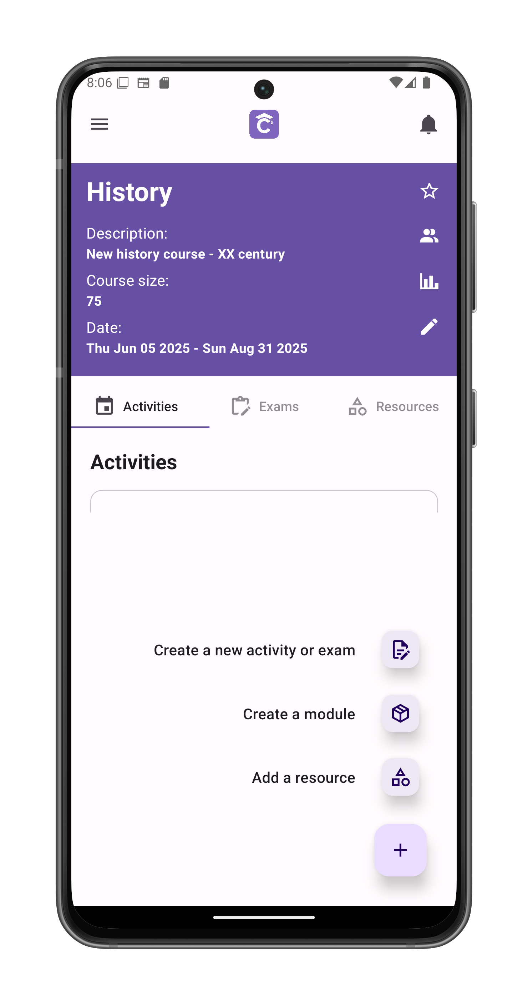
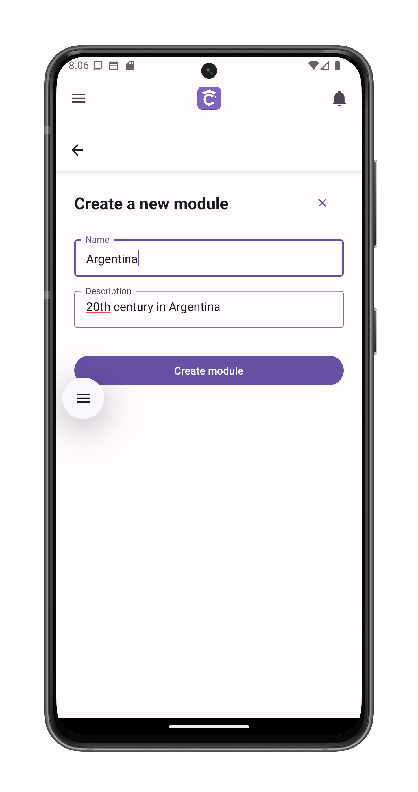
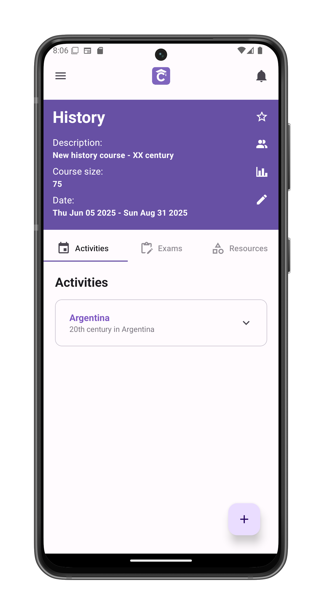

# Create a New Module

Organize course materials into logical groups. Modules function like folders that can contain assignments, exams, and resources together.

## Accessing Module Creation
1. Tap the ⊕ button in course view
2. Select "Create new module"
3. Opens the module creation interface

## Required Fields
1. **Module Name**  
   (e.g., "Week 1 - Introduction")
   
2. **Description**  
   (e.g., "Basic concepts and orientation materials")

## Module Behavior
After creation:
- Appears in all three tabs:
  - **Activities**: Shows assignments/tests
  - **Exams**: Displays scheduled exams
  - **Resources**: Lists study materials
- Content type visibility adapts to current tab
- Maintains consistent ordering across views

## Adding Content
Create materials directly within modules via:
- [Create test/assignment](/app-manual/teachers/activity-create)
- [Add new resources](/app-manual/teachers/resource-create)

## Management Tips
- Name modules consistently (e.g., "Week X - Topic")
- Use descriptions to clarify scope
- Modules cannot be merged after creation
- Empty modules display placeholder text

## Visibility Rules
- Students see published modules only
- Draft modules appear to teachers only
- Automatic date-based hiding after end date